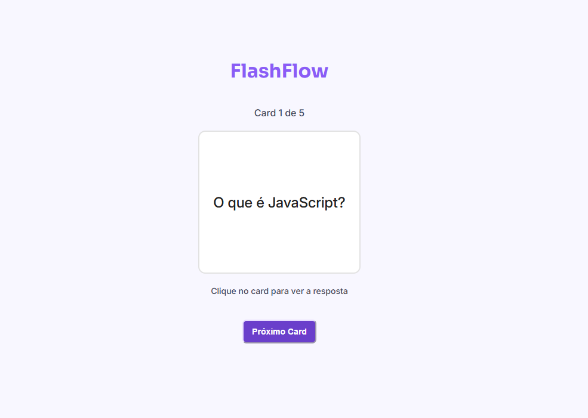

# 🧠 Projeto Flashcards

Este é um projeto de estudo criado com **HTML**, **CSS** e **JavaScript puro**, com o objetivo de reforçar conceitos por meio de flashcards interativos. O usuário pode visualizar perguntas e clicar para revelar as respostas, alternando livremente entre os cards.

## 🚀 Funcionalidades

- Exibição de cards com perguntas.
- Clique para revelar a resposta.
- Cards embaralhados a cada atualização.
- Design responsivo e limpo.

## 💡 Objetivo do Projeto

Praticar os fundamentos de desenvolvimento web front-end, trabalhando com manipulação do DOM, estilização com CSS e lógica com JavaScript.

## 📁 Tecnologias

- HTML5
- CSS3
- JavaScript

## 🔗 Acesse o projeto

👉 [FlashFlow](https://antoniobreis.github.io/flashflow/)

---

*Desenvolvido por [Antonio Breis](https://github.com/antoniobreis) como prática de estudos.*